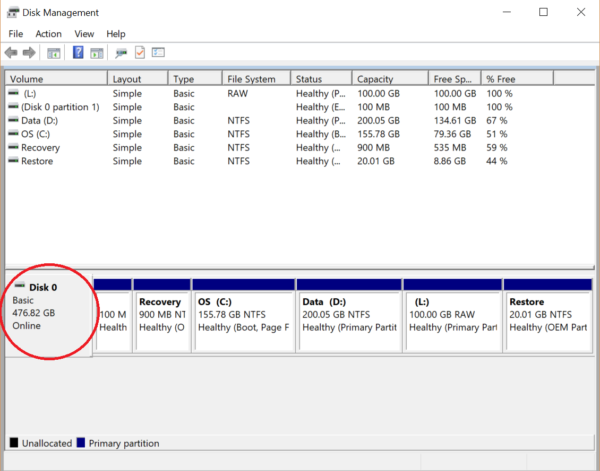
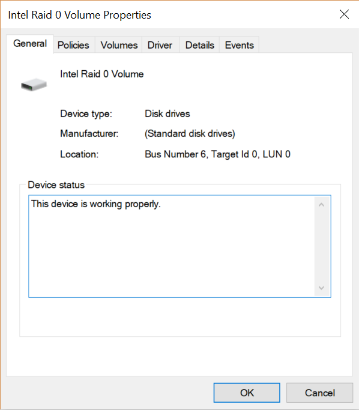
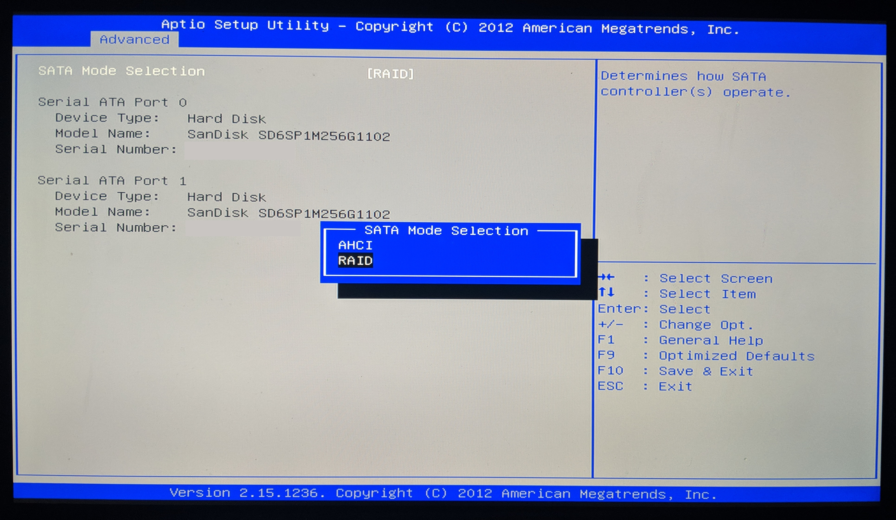
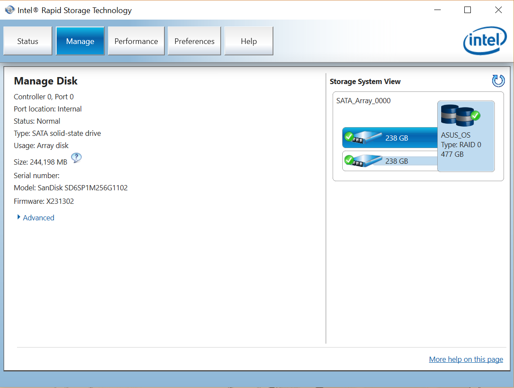

# Create a partition for Linux

This operation could be done entirely with Linux. However it can be more convenient to create the partition directly with Windows in order to not mess up existing disk partitions, in particular when the laptop is configured with RAID.

> RAID (Redundant Array of Independent Disks) is a data storage virtualization technology that combines multiple physical disk drive components into one or more logical units for the purposes of data redundancy, performance improvement, or both
>
> \- Wikipedia

RAID is used to enhance performance and/or data recovery. It defines [6 levels](https://en.wikipedia.org/wiki/Standard_RAID_levels) that leverage different techniques such as striping, mirroring and parity.

There are three [types of RAID](https://en.wikipedia.org/wiki/RAID#Implementations):

- Hardware RAID: RAID managed by an actual external RAID controller.
- Software RAID: RAID managed by the Operating System.
- Firmware/Driver RAID, also called "fake RAID": RAID managed by the motherboard.

1.  Check ASUS PC UX301LAA disk type

    - Open the "Disk Management" panel: go to `Control Panel > System and Security > Administrative Tools > Create and format hard disk partitions` and check how many disks there are and their type:

      

      There is only one disk and it is of type "Basic". This excludes the possibility of having a Software RAID since in that case the OS would show multiple disk of type "Dynamic" with the same drive letter.

    - Right click on the disk where the partition will be and select "Properties":

      

      The device display name is "Intel RAID 0 Volume" which strongly hints that the PC is using a Firmware/Fake RAID.

    - Enter [UEFI/BIOS configuration](./general-tips.md#enter-uefibios-configuration) and check the SATA mode:

      

      [SATA](https://en.wikipedia.org/wiki/Serial_ATA) (Serial ATA, abbreviated from "Serial AT Attachment") is a computer bus interface that connects host bus adapters to mass storage devices such as hard disk drives, optical drives, and solid-state drives. It replaces the older PATA (Parallel ATA) standard. See [Why is serial data transmission faster than parallel?](https://superuser.com/questions/602819/why-is-serial-data-transmission-faster-than-parallel)

      [AHCI](https://en.wikipedia.org/wiki/Advanced_Host_Controller_Interface) (Advanced Host Controller Interface) is an enhanced version of the SATA standard. It would consider each physical disk as a separate disk.

      [RAID](https://en.wikipedia.org/wiki/RAID) (Redundant Array of Independent Disks) is a SATA mode where physical disks are combined together by the firmware into a one or multiple "virtual disk" according to one of the standard RAID levels.

      The SATA mode, set to "RAID", confirms this PC is using Firmware/Fake RAID.

    - To double check, download and install [Intel® Rapid Storage Technology (Intel® RST) User Interface and Driver](https://downloadcenter.intel.com/download/27681/Intel-Rapid-Storage-Technology-Intel-RST-User-Interface-and-Driver). Then open "Intel® Rapid Storage Technology" and check the disk type:

      

      This PC has one 512GB disk made of two 256GB SSD (i.e. 238GiB) organize in a [RAID 0](https://en.wikipedia.org/wiki/Standard_RAID_levels#RAID_0): this means that the data is split between the two disks in stripes of 128KiB.

    See [How to check if hardware RAID is configured?](https://serverfault.com/questions/53368/how-to-check-if-hardware-raid-is-configured) for more details.

1.  Using Disk Management, create a new partition:

    - Select an existing partition
    - Right click and select "Shrink Volume...".
    - Specify the space you want to free: in our case, we create a slot of 100GB unallocated.
    - To make sure our new partition will be seen without any issues by Linux, format it (for example as NTFS).

1.  We will later on format the newly defined partition with a file system that Linux supports.
