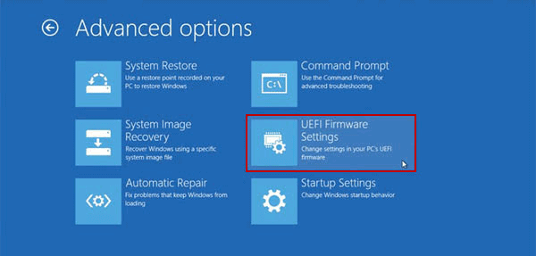

# General Tips

## Enter UEFI/BIOS configuration:

- select `Windows menu key > Power > Hold Shift + Restart`.

- then select `Troubleshoot > Advanced Options > UEFI Firmware Settings`.

  
  
  <br/>
  

See [How to enter BIOS configuration?](https://www.asus.com/support/faq/1013015/) or [How to Access UEFI BIOS in Windows 10](https://www.cocosenor.com/articles/windows-10/access-uefi-bios-in-windows-10.html) for alternative methods.

## Understand lsblk and blkid output

- Example of output with 2 disks under a firmware RAID 0:

  ```console
  > lsblk
  NAME        MAJ:MIN RM   SIZE RO TYPE  MOUNTPOINT
  sda           8:0    0 238.5G  0 disk
  └─md126       9:126  0   477G  0 raid0
    ├─md126p1 259:0    0   100M  0 md    /boot
    ├─md126p2 259:1    0   900M  0 md
    ├─md126p3 259:2    0   128M  0 md
    ├─md126p4 259:3    0 155.8G  0 md
    ├─md126p5 259:4    0 200.1G  0 md
    ├─md126p6 259:5    0   100G  0 md    /
    └─md126p7 259:6    0    20G  0 md
  sdb           8:16   0 238.5G  0 disk
  └─md126       9:126  0   477G  0 raid0
    ├─md126p1 259:0    0   100M  0 md    /boot
    ├─md126p2 259:1    0   900M  0 md
    ├─md126p3 259:2    0   128M  0 md
    ├─md126p4 259:3    0 155.8G  0 md
    ├─md126p5 259:4    0 200.1G  0 md
    ├─md126p6 259:5    0   100G  0 md    /
    └─md126p7 259:6    0    20G  0 md

  > sudo blkid
  /dev/sdb: TYPE="isw_raid_member"
  /dev/md126: PTUUID="<PTUUID>" PTTYPE="gpt"
  /dev/sda: TYPE="isw_raid_member"
  /dev/md126p1: LABEL="SYSTEM" UUID="<UUID>" TYPE="vfat" PARTLABEL="EFI system partition" PARTUUID="<PARTUUID>"
  /dev/md126p2: LABEL="Recovery" UUID="<UUID>" TYPE="ntfs" PARTLABEL="Basic data partition" PARTUUID="<PARTUUID>"
  /dev/md126p3: PARTLABEL="Microsoft reserved partition" PARTUUID="<PARTUUID>"
  /dev/md126p4: LABEL="OS" UUID="<UUID>" TYPE="ntfs" PARTLABEL="Basic data partition" PARTUUID="<PARTUUID>"
  /dev/md126p5: LABEL="Data" UUID="<UUID>" TYPE="ntfs" PARTLABEL="Basic data partition" PARTUUID="<PARTUUID>"
  /dev/md126p6: UUID="<UUID>" TYPE="ntfs" PARTLABEL="Basic data partition" PARTUUID="<PARTUUID>"
  /dev/md126p7: LABEL="Restore" UUID="<UUID>" TYPE="ntfs" PARTLABEL="Basic data partition" PARTUUID="<PARTUUID>"
  ```

  `sd` stands for [SCSI disk drive driver](https://linux.die.net/man/4/sd). [SCSI](https://en.wikipedia.org/wiki/SCSI) (Small Computer System Interface) is a set of standards for physically connecting and transferring data between computers and peripheral devices.

  `md` stands for [multi device driver](https://linux.die.net/man/4/md), and represent the virtual RAID disk.

  `p` stands for partition.

  `isw_raid_member` refers to Intel firmware RAID as opposed to `linux_raid_member` which refers to Linux Software RAID.

  Linux detects two 238.5G physical drives "sda" and "sdb" that are virtually grouped under a RAID 0 "md126".

- Example of output with a single NVMe SSD:

  ```console
    > lsblk
    NAME        MAJ:MIN RM   SIZE RO TYPE MOUNTPOINT
    nvme0n1     259:0    0   477G  0 disk
    ├─nvme0n1p1 259:1    0   500M  0 part /boot
    ├─nvme0n1p2 259:2    0   128M  0 part
    ├─nvme0n1p3 259:3    0 250.9G  0 part
    ├─nvme0n1p4 259:4    0 224.6G  0 part /
    └─nvme0n1p5 259:5    0   825M  0 part

    > sudo blkid
    /dev/nvme0n1: PTUUID="<PTUUID>" PTTYPE="gpt"
    /dev/nvme0n1p1: LABEL="ESP" UUID="<UUID>" TYPE="vfat" PARTLABEL="EFI system partition" PARTUUID="<PARTUUID>"
    /dev/nvme0n1p2: PARTLABEL="Microsoft reserved partition" PARTUUID="<PARTUUID>"
    /dev/nvme0n1p3: LABEL="OS" UUID="<UUID>" TYPE="ntfs" PARTLABEL="Basic data partition" PARTUUID="<PARTUUID>"
    /dev/nvme0n1p4: UUID="<UUID>" TYPE="ext4" PARTLABEL="Basic data partition" PARTUUID="<PARTUUID>"
    /dev/nvme0n1p5: UUID="<UUID>" TYPE="ntfs" PARTUUID="<PARTUUID>"
  ```

  `nvme` stands for [Non-Volatile Memory Express](https://en.wikipedia.org/wiki/NVM_Express).

  `n1` stands for the first namespace of that NVMe device.

  `p` stands for partition.

  Linux detects one 477G physical drive "nvme0n1".

## Get info about RAID

```console
> lsblk
NAME        MAJ:MIN RM   SIZE RO TYPE  MOUNTPOINT
sda           8:0    0 238.5G  0 disk
└─md126       9:126  0   477G  0 raid0
  ├─md126p1 259:0    0   100M  0 md    /boot
  ├─md126p2 259:1    0   900M  0 md
  ├─md126p3 259:2    0   128M  0 md
  ├─md126p4 259:3    0 155.8G  0 md
  ├─md126p5 259:4    0 200.1G  0 md
  ├─md126p6 259:5    0   100G  0 md    /
  └─md126p7 259:6    0    20G  0 md
sdb           8:16   0 238.5G  0 disk
└─md126       9:126  0   477G  0 raid0
  ├─md126p1 259:0    0   100M  0 md    /boot
  ├─md126p2 259:1    0   900M  0 md
  ├─md126p3 259:2    0   128M  0 md
  ├─md126p4 259:3    0 155.8G  0 md
  ├─md126p5 259:4    0 200.1G  0 md
  ├─md126p6 259:5    0   100G  0 md    /
  └─md126p7 259:6    0    20G  0 md

> sudo blkid
/dev/sdb: TYPE="isw_raid_member"
/dev/md126: PTUUID="<PTUUID>" PTTYPE="gpt"
/dev/sda: TYPE="isw_raid_member"
/dev/md126p1: LABEL="SYSTEM" UUID="<UUID>" TYPE="vfat" PARTLABEL="EFI system partition" PARTUUID="<PARTUUID>"
/dev/md126p2: LABEL="Recovery" UUID="<UUID>" TYPE="ntfs" PARTLABEL="Basic data partition" PARTUUID="<PARTUUID>"
/dev/md126p3: PARTLABEL="Microsoft reserved partition" PARTUUID="<PARTUUID>"
/dev/md126p4: LABEL="OS" UUID="<UUID>" TYPE="ntfs" PARTLABEL="Basic data partition" PARTUUID="<PARTUUID>"
/dev/md126p5: LABEL="Data" UUID="<UUID>" TYPE="ntfs" PARTLABEL="Basic data partition" PARTUUID="<PARTUUID>"
/dev/md126p6: UUID="<UUID>" TYPE="ntfs" PARTLABEL="Basic data partition" PARTUUID="<PARTUUID>"
/dev/md126p7: LABEL="Restore" UUID="<UUID>" TYPE="ntfs" PARTLABEL="Basic data partition" PARTUUID="<PARTUUID>"

> lspci -vv|grep -i raid
00:1f.2 RAID bus controller: Intel Corporation 82801 Mobile SATA Controller [RAID mode] (rev 04)
      Subsystem: ASUSTeK Computer Inc. 82801 Mobile SATA Controller [RAID mode]

> sudo cat proc/mdstat
Personalities : [raid0]
md126 : active raid0 sda[1] sdb[0]
      500113408 blocks super external:/md127/0 128k chunks

md127 : inactive sda[1](S) sdb[0](S)
      4520 blocks super external:imsm

unused devices: <none>

> mdadm -D /dev/md126
/dev/md126:
      Container : /dev/md/imsm0, member 0
    Raid Level : raid0
    Array Size : 500113408 (476.95 GiB 512.12 GB)
  Raid Devices : 2
  Total Devices : 2

          State : clean
Active Devices : 2
Working Devices : 2
Failed Devices : 0
  Spare Devices : 0

    Chunk Size : 128K

          UUID : <uuid>
    Number   Major   Minor   RaidDevice State
      1       8        0        0      active sync   /dev/sda
      0       8       16        1      active sync   /dev/sdb

> mdadm -D /dev/imsm0
/dev/md/imsm0:
        Version : imsm
    Raid Level : container
  Total Devices : 2

Working Devices : 2

          UUID : <uuid>
  Member Arrays : /dev/md/ASUS_OS_0

    Number   Major   Minor   RaidDevice

      0       8       16        -        /dev/sdb
      1       8        0        -        /dev/sda
```

Where `imsm` stands for [Intel Matrix Storage Manager](https://en.wikipedia.org/wiki/Intel_Matrix_RAID)

## Troubleshoot Booting

If, for any reason, the system does not boot and prompt you to Arch emergency shell:

```
Error: unable to find root device 'UUID=<uuid>'
You are now being dropped into a emergency shell.
```

1.  Reboot the system

1.  Insert an Arch Linux installer USB drive.

1.  Using the GRUB interface, enter the UEFI/BIOS configuration:

    - if available, select the "firmware setup" option
    - type `c` to go to GRUB command line and run `fwsetup`

1.  From the UEFI/BIOS select the USB drive

1.  Access and edit your Linux file system from the USB drive using the `mnt` and `arch-chroot` commands

## Others

- GRUB console: how to boot back to USB
- GRUB console: force boot from USB

  - https://www.linuxquestions.org/questions/ubuntu-63/error-no-such-device-4175619033/
  - https://help.ubuntu.com/community/Grub2/Troubleshooting

  - https://superuser.com/questions/349633/boot-from-usb-using-grub
  - https://askubuntu.com/questions/616811/gnu-grub-terminal-instead-of-ubuntu-login-screen
  - https://www.linux.com/learn/how-rescue-non-booting-grub-2-linux%20

- windows update: restore UEFI settings fast startup disabled + boot order (add boot + reorder)

  ```bash
  > efibootmgr
  BootCurrent: 0002
  Timeout: 2 seconds
  BootOrder: 0002,0000,0001,0003,0004
  Boot0000* Windows Boot Manager
  Boot0001* UEFI:CD/DVD Drive
  Boot0002* Arch Linux Boot Manager
  Boot0003* UEFI:Removable Device
  Boot0004* UEFI:Network Device
  ```

```

```
