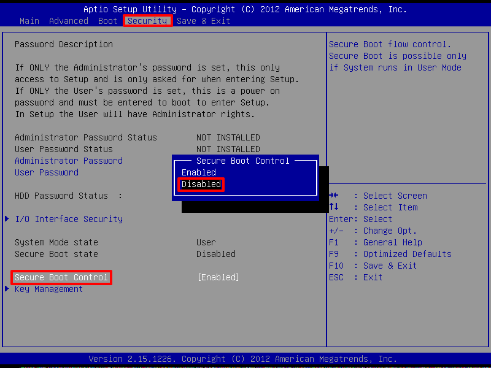

# Dual Boot Arch Linux - Windows 10 on ASUS PC UX301LAA

## Prepare Windows 10

1.  Double check the PC motherboard firmware "BIOS mode" is [UEFI](https://en.wikipedia.org/wiki/Unified_Extensible_Firmware_Interface). This should be the case with Windows 10. See [How to Check if Windows is Booted in UEFI or Legacy BIOS Mode​](https://www.eightforums.com/threads/bios-mode-see-if-windows-boot-in-uefi-or-legacy-mode.29504/) for more details.

    Each motherboard is shipped with a firmware to handle the hardware initialization process. Designed in 1975, BIOS, a.k.a. "Basic Input-Output System" has been the norm for boot firmware until 2005. UEFI, a.k.a. "Unified Extensible Firmware Interface", is BIOS' improved successor. It is shipped with modern PC and is the one used in this tutorial to install Arch Linux.

    * Open command prompt and launch "Sytem Information": `Windows + R > cmd > msinfo32`

      

    * Make sure "BIOS mode" is `UEFI`

1.  Disable "fast startup":

    This is to avoid potential data loss. Indeed, Windows "fast startup" boots the sytem faster by reading the necessary information from the hibernation file. Therefore, once Windows is shutdown, if you attempt to copy some files from Linux to Windows, those files would be lost because not present in the hibernation file. See [Why disable Fast Boot on Windows 8 when having dual booting?](https://askubuntu.com/questions/452071/why-disable-fast-boot-on-windows-8-when-having-dual-booting) for more details.

    * Go to `Control Panel > Hardware and Sound > Power Options > System Settings`

      

    * Uncheck "Turn on fast start-up"

1.  Disable "Secure Boot Control"

    With UEFI comes the "Secure Boot Control" options that ensures your PC only uses signed firmware that is trusted by the manufacturer. While it prevents malicious firmware to be installed, this could also potentially prevents you from installing Linux drivers. Note that it is still possible to [install Arch Linux with "Secure Boot Control" enabled](https://wiki.archlinux.org/index.php/Secure_Boot).

    * Enter UEFI/BIOS configuration:

      * select `Windows menu key > Power > Hold Shift + Restart`.

      * then select `Troubleshoot > Advanced Options > UEFI Firmware Settings`.

        
        
         
        

      See [How to enter BIOS configuration?](https://www.asus.com/support/faq/1013015/) or [How to Access UEFI BIOS in Windows 10](https://www.cocosenor.com/articles/windows-10/access-uefi-bios-in-windows-10.html) for alternative methods.

    * Under the "Security" tab, set "Secure Boot Control" to disabled: https://www.asus.com/support/FAQ/1013017/

      

For more information check out [How to prepare Windows for dual boot with Ubuntu or Linux Mint](https://sites.google.com/site/easylinuxtipsproject/windows).

## Create an Arch Linux installer USB drive from Windows

1.  Download Rufus from http://rufus.akeo.ie
1.  Download Arch Linux `iso` from https://www.archlinux.org/download/
1.  Insert a usb key with a capacity greater than the ISO size
1.  Launch Rufus and select the following parameters:

    

    * Partition scheme: "GPT partition scheme for UEFI"

      MBR (Master Boot Record) and GPT (GUID Partition Table) are two different ways of storing the partitioning information on a drive. This information includes where partitions start and begin, so your operating system knows which sectors belong to each partition and which partition is bootable. GPT is MBR's improved successor and is the one used in this tutorial. For more details, see [What’s the Difference Between GPT and MBR When Partitioning a Drive?](https://www.linkedin.com/pulse/whats-difference-between-gpt-mbr-when-partitioning-drive-tiwari)

    * File system: "FAT32"

      For a bootable device to be seen by a UEFI system, the device must be formatted using FAT32.

    * Cluster Size: 4096 bytes

      A cluster is the smallest logical amount of disk space that can be allocated to hold a file. It mostly affects performance and wasted disk space. For a live USB, the default cluster size is good enough. The default cluster size for a disk with a few gigabytes of space and formatted with FAT32 is 4096 bytes. See [Default cluster size for NTFS, FAT, and exFAT](https://support.microsoft.com/en-us/help/140365/default-cluster-size-for-ntfs-fat-and-exfat) for more details.

    * Check "Create a bootable disk using ...", select the Arch ISO image file and choose "DD Image" (Disk Image mode).

      [ISO images](http://en.wikipedia.org/wiki/ISO_image) are binary file that contains uncompressed exact copy of a file system. They were originally designed for optical media file systems such as [ISO-9660](https://en.wikipedia.org/wiki/ISO_9660) or [Universal Disk Format](https://en.wikipedia.org/wiki/Universal_Disk_Format) (UDF).

      Not every ISO images are bootable. To make such an image bootable, it needs to follow the [El-Torito](https://wiki.osdev.org/El-Torito) specification.

      At this point, the ISO image would be bootable only by an optical disc media. To make it bootable on both optical disk media and USB media, one need to run the [ISOHybrid command](https://www.syslinux.org/wiki/index.php?title=Isohybrid) from syslinux. This command postprocesses the ISO image file by enriching its file system with a Master Boot Record (MBR) partition, in order for BIOS/UEFI systems to consider it as a bootable hard disk. The Arch ISO image file is a ISOHybrid image.

      **ISO image mode** partition and format the USB in a way that Windows can always understand and using the whole capacity of the drive. Each individual file and directory from the ISO image is then copied onto the newly created file system.

      **Disk Image mode** (a.k.a. "DD Image") will create an exact bit-for-bit clone of the ISO image to the media. As a consequence, the media will not be recognize as a regular USB stick anymore: Windows might not be able to access its content and the size will appear shrinked to the ISO size.

      Since ISOHybrid images comes with their own file system and partitions, one need to select the "Disk Image" mode.

      For more details see:
      * [ISO Image Mode vs DD Image Mode](https://github.com/pbatard/rufus/issues/843)
      * [Why Is Creating a Bootable USB Drive More Complex Than Creating Bootable CDs?](https://www.howtogeek.com/291484/why-is-creating-a-bootable-usb-drive-more-complex-than-creating-bootable-cds/)
      * [How to build from Linux an ISO hybrid image bootable from BIOS or UEFI](https://github.com/patatetom/isohybrid-bios-uefi)
      * [Creating a bootable USB drive from an ISO image](https://www.turnkeylinux.org/blog/iso2usb)

For more information check out [How to Create Bootable Arch Linux on USB Drive](https://linoxide.com/linux-how-to/create-bootable-arch-linux-usb-drive/) and the Arch Linux wiki on [USB flash installation media](https://wiki.archlinux.org/index.php/USB_flash_installation_media#Using_Rufus).
