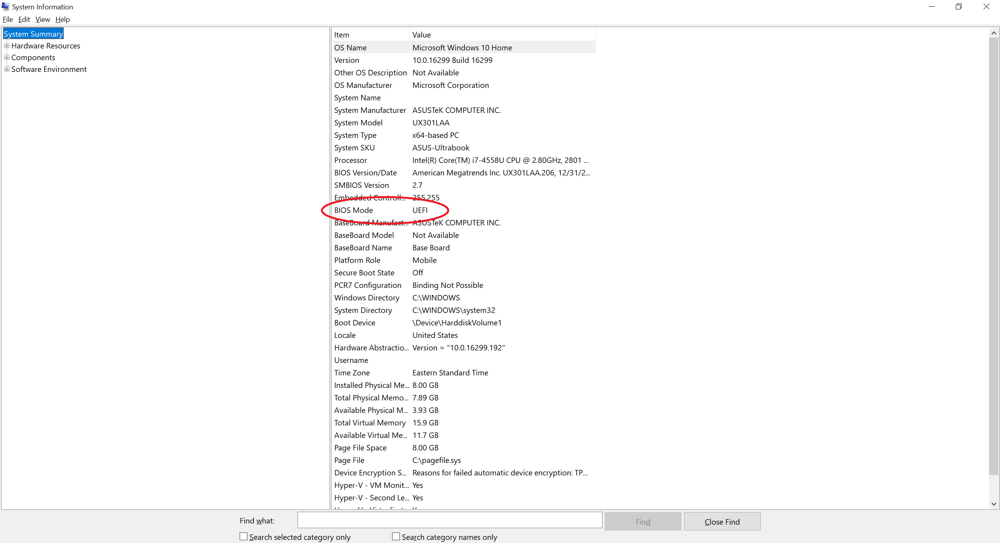
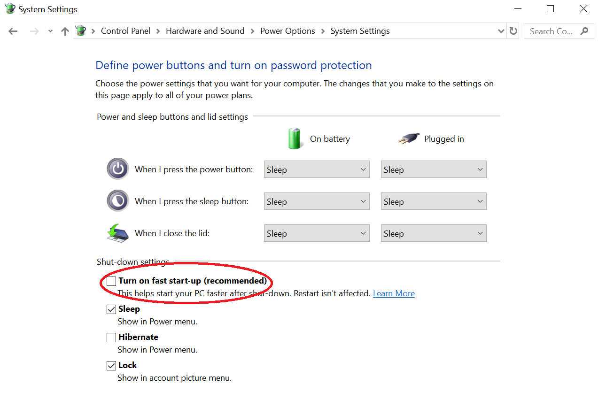
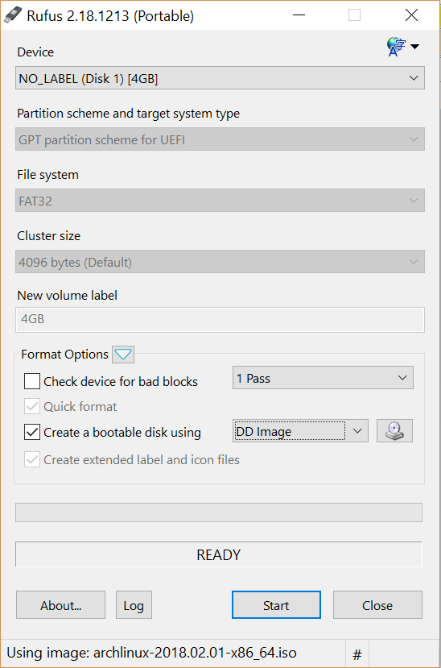
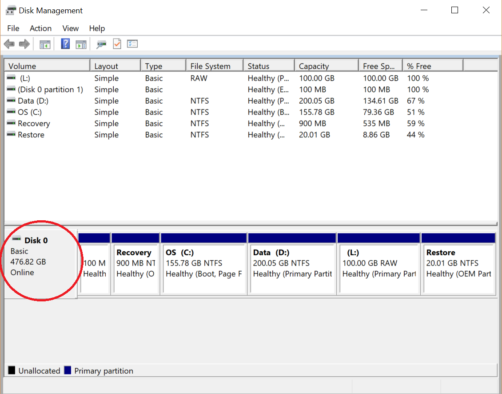
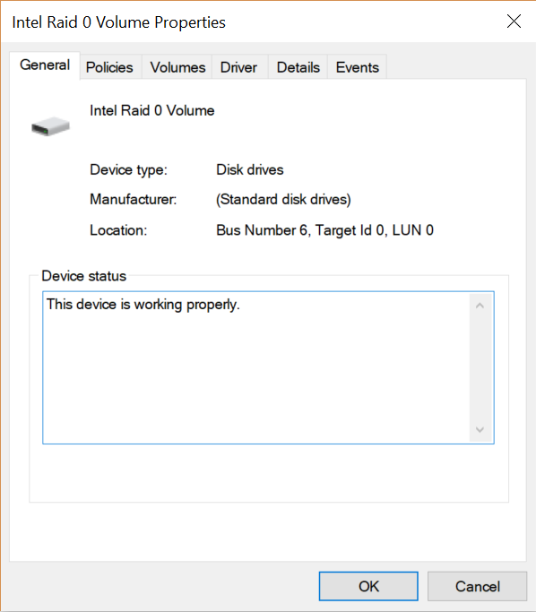
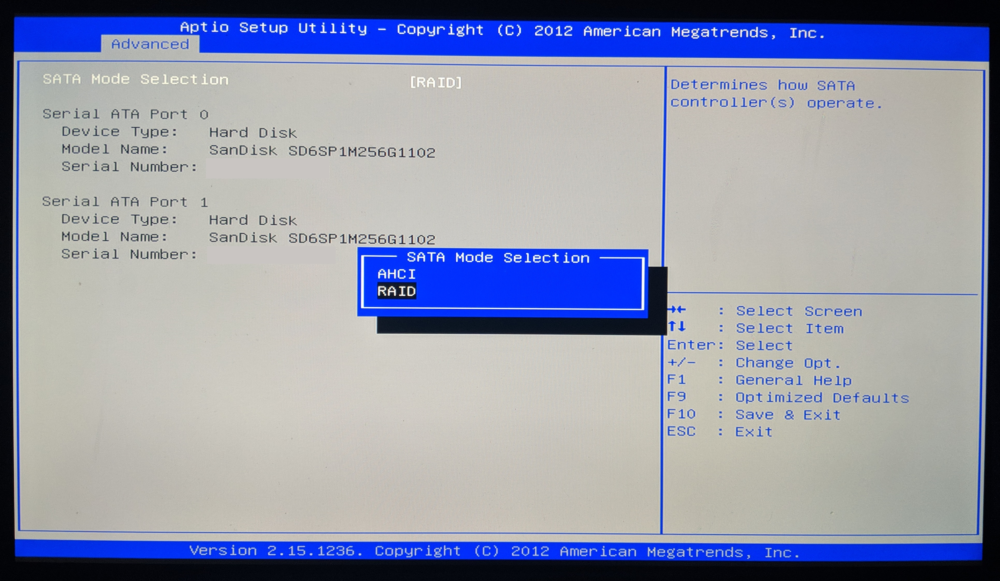
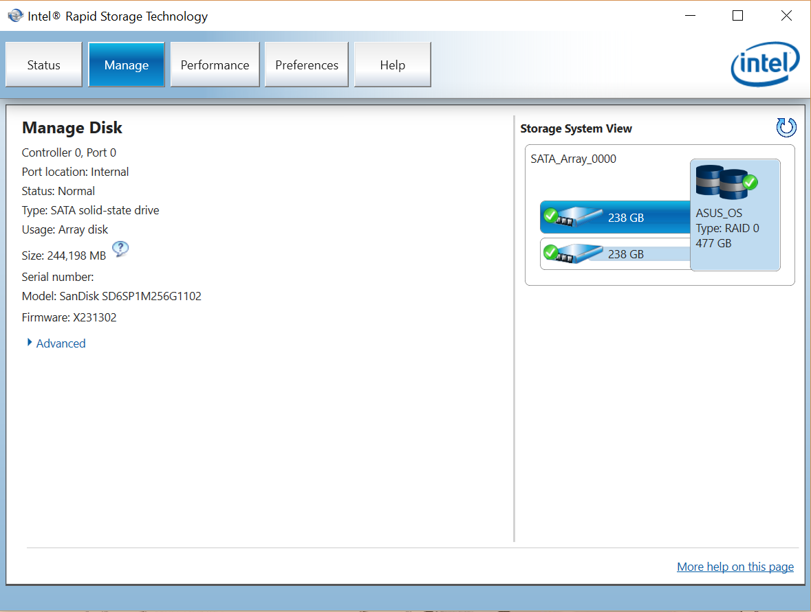
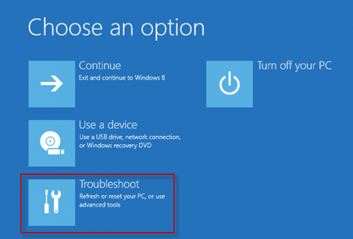
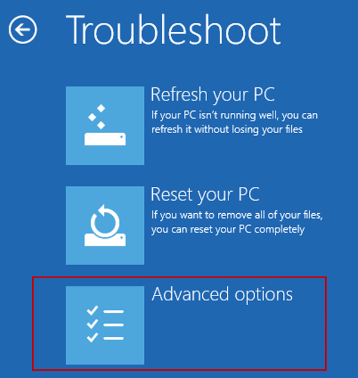
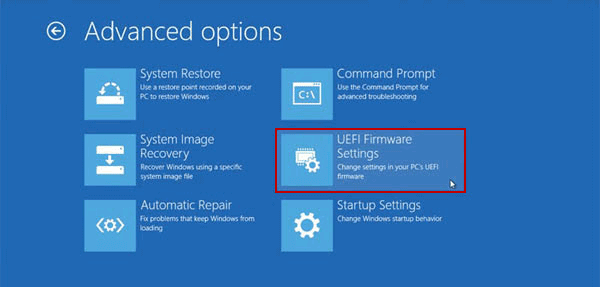

# Dual Boot Arch Linux - Windows 10 on ASUS PC UX301LAA

## Prepare Windows 10

1.  Double check the PC motherboard firmware "BIOS mode" is [UEFI](https://en.wikipedia.org/wiki/Unified_Extensible_Firmware_Interface). This should be the case with Windows 10. See [How to Check if Windows is Booted in UEFI or Legacy BIOS Mode​](https://www.eightforums.com/threads/bios-mode-see-if-windows-boot-in-uefi-or-legacy-mode.29504/) for more details.

    Each motherboard is shipped with a firmware to handle the hardware initialization process. Designed in 1975, BIOS, a.k.a. "Basic Input-Output System" has been the norm for boot firmware until 2005. UEFI, a.k.a. "Unified Extensible Firmware Interface", is BIOS' improved successor. It is shipped with modern PC and is the one used in this tutorial to install Arch Linux.

    - Open command prompt and launch "Sytem Information": `Windows + R > cmd > msinfo32`

      

    - Make sure "BIOS mode" is `UEFI`

1.  Disable "fast startup":

    This is to avoid potential data loss. Indeed, Windows "fast startup" boots the sytem faster by reading the necessary information from the hibernation file. Therefore, once Windows is shutdown, if you attempt to copy some files from Linux to Windows, those files would be lost because not present in the hibernation file. See [Why disable Fast Boot on Windows 8 when having dual booting?](https://askubuntu.com/questions/452071/why-disable-fast-boot-on-windows-8-when-having-dual-booting) for more details.

    - Go to `Control Panel > Hardware and Sound > Power Options > System Settings`

      

    - Uncheck "Turn on fast start-up"

1.  Disable "Secure Boot Control"

    With UEFI comes the "Secure Boot Control" options that ensures your PC only uses signed firmware that is trusted by the manufacturer. While it prevents malicious firmware to be installed, this could also potentially prevents you from installing Linux drivers. Note that it is still possible to [install Arch Linux with "Secure Boot Control" enabled](https://wiki.archlinux.org/index.php/Secure_Boot).

    - Enter [UEFI/BIOS configuration](#enter-uefibios-configuration)

    - Under the "Security" tab, set "Secure Boot Control" to disabled: https://www.asus.com/support/FAQ/1013017/

      

For more information check out [How to prepare Windows for dual boot with Ubuntu or Linux Mint](https://sites.google.com/site/easylinuxtipsproject/windows).

## Create an Arch Linux installer USB drive from Windows

1.  Download Rufus from http://rufus.akeo.ie
1.  Download Arch Linux `iso` from https://www.archlinux.org/download/
1.  Insert a usb key with a capacity greater than the ISO size
1.  Launch Rufus and select the following parameters:

    

    - Partition scheme: "GPT partition scheme for UEFI"

      MBR (Master Boot Record) and GPT (GUID Partition Table) are two different ways of storing the partitioning information on a drive. This information includes where partitions start and begin, so your operating system knows which sectors belong to each partition and which partition is bootable. GPT is MBR's improved successor and is the one used in this tutorial. For more details, see [What’s the Difference Between GPT and MBR When Partitioning a Drive?](https://www.linkedin.com/pulse/whats-difference-between-gpt-mbr-when-partitioning-drive-tiwari)


    * File system: "FAT32"

      For a bootable device to be seen by a UEFI system, the device must be formatted using FAT32.

    * Cluster Size: 4096 bytes

      A cluster is the smallest logical amount of disk space that can be allocated to hold a file. It mostly affects performance and wasted disk space. For a live USB, the default cluster size is good enough. The default cluster size for a disk with a few gigabytes of space and formatted with FAT32 is 4096 bytes. See [Default cluster size for NTFS, FAT, and exFAT](https://support.microsoft.com/en-us/help/140365/default-cluster-size-for-ntfs-fat-and-exfat) for more details.

    * Check "Create a bootable disk using ...", select the Arch ISO image file and choose "DD Image" (Disk Image mode).

      [ISO images](http://en.wikipedia.org/wiki/ISO_image) are binary file that contains uncompressed exact copy of a file system. They were originally designed for optical media file systems such as [ISO-9660](https://en.wikipedia.org/wiki/ISO_9660) or [Universal Disk Format](https://en.wikipedia.org/wiki/Universal_Disk_Format) (UDF).

      Not every ISO images are bootable. To make such an image bootable, it needs to follow the [El-Torito](https://wiki.osdev.org/El-Torito) specification.

      At this point, the ISO image would be bootable only by an optical disc media. To make it bootable on both optical disk media and USB media, one need to run the [ISOHybrid command](https://www.syslinux.org/wiki/index.php?title=Isohybrid) from syslinux. This command postprocesses the ISO image file by enriching its file system with a Master Boot Record (MBR) partition, in order for BIOS/UEFI systems to consider it as a bootable hard disk. The Arch ISO image file is a ISOHybrid image.

      **ISO image mode** partition and format the USB in a way that Windows can always understand and using the whole capacity of the drive. Each individual file and directory from the ISO image is then copied onto the newly created file system.

      **Disk Image mode** (a.k.a. "DD Image") will create an exact bit-for-bit clone of the ISO image to the media. As a consequence, the media will not be recognize as a regular USB stick anymore: Windows might not be able to access its content and the size will appear shrinked to the ISO size.

      Since ISOHybrid images comes with their own file system and partitions, one need to select the "Disk Image" mode.

    For more details see:

      * [ISO Image Mode vs DD Image Mode](https://github.com/pbatard/rufus/issues/843)
      * [Why Is Creating a Bootable USB Drive More Complex Than Creating Bootable CDs?](https://www.howtogeek.com/291484/why-is-creating-a-bootable-usb-drive-more-complex-than-creating-bootable-cds/)
      * [How to build from Linux an ISO hybrid image bootable from BIOS or UEFI](https://github.com/patatetom/isohybrid-bios-uefi)
      * [Creating a bootable USB drive from an ISO image](https://www.turnkeylinux.org/blog/iso2usb)

For more information check out [How to Create Bootable Arch Linux on USB Drive](https://linoxide.com/linux-how-to/create-bootable-arch-linux-usb-drive/) and the Arch Linux wiki on [USB flash installation media](https://wiki.archlinux.org/index.php/USB_flash_installation_media#Using_Rufus).

## Create a partition for Linux

This operation could be done entirely with Linux. However it can be more convenient to create the partition directly with Windows in order to not mess up existing disk partitions, in particular when the laptop is configured with RAID.

> RAID (Redundant Array of Independent Disks) is a data storage virtualization technology that combines multiple physical disk drive components into one or more logical units for the purposes of data redundancy, performance improvement, or both
>
> \- Wikipedia

RAID is used to enhance performance and/or data recovery. It defines [6 levels](https://en.wikipedia.org/wiki/Standard_RAID_levels) that leverage different techniques such as striping, mirroring and parity.

There are three [types of RAID](https://en.wikipedia.org/wiki/RAID#Implementations):

- Hardware RAID: RAID managed by an actual external RAID controller.
- Software RAID: RAID managed by the Operating System.
- Firmware/Driver RAID, also called "fake RAID": RAID managed by the motherboard.

1.  Check ASUS PC UX301LAA disk type

    - Open the "Disk Management" panel: go to `Control Panel > System and Security > Administrative Tools > Create and format hard disk partitions` and check how many disks there are and their type:

      

      There is only one disk and it is of type "Basic". This excludes the possibility of having a Software RAID since in that case the OS would show multiple disk of type "Dynamic" with the same drive letter.

    - Right click on the disk where the partition will be and select "Properties":

      

      The device display name is "Intel RAID 0 Volume" which strongly hints that the PC is using a Firmware/Fake RAID.

    - Enter [UEFI/BIOS configuration](#enter-uefibios-configuration) and check the SATA mode:

      

      [SATA](https://en.wikipedia.org/wiki/Serial_ATA) (Serial ATA, abbreviated from "Serial AT Attachment") is a computer bus interface that connects host bus adapters to mass storage devices such as hard disk drives, optical drives, and solid-state drives. It replaces the older PATA (Parallel ATA) standard. See [Why is serial data transmission faster than parallel?](https://superuser.com/questions/602819/why-is-serial-data-transmission-faster-than-parallel)

      [AHCI](https://en.wikipedia.org/wiki/Advanced_Host_Controller_Interface) (Advanced Host Controller Interface) is an enhanced version of the SATA standard. It would consider each physical disk as a separate disk.

      [RAID](https://en.wikipedia.org/wiki/RAID) (Redundant Array of Independent Disks) is a SATA mode where physical disks are combined together by the firmware into a one or multiple "virtual disk" according to one of the standard RAID levels.

      The SATA mode, set to "RAID", confirms this PC is using Firmware/Fake RAID.

    - To double check, download and install [Intel® Rapid Storage Technology (Intel® RST) User Interface and Driver](https://downloadcenter.intel.com/download/27681/Intel-Rapid-Storage-Technology-Intel-RST-User-Interface-and-Driver). Then open "Intel® Rapid Storage Technology" and check the disk type:

      

      This PC has one 512GB disk made of two 256GB SSD (i.e. 238GiB) organize in a [RAID 0](https://en.wikipedia.org/wiki/Standard_RAID_levels#RAID_0): this means that the data is split between the two disks in stripes of 128KiB.

    See [How to check if hardware RAID is configured?](https://serverfault.com/questions/53368/how-to-check-if-hardware-raid-is-configured) for more details.

1.  Using Disk Management, create a new partition:

    - Select an existing partition
    - Right click and select "Shrink Volume...".
    - Specify the space you want to free: in our case, we create a slot of 100GB unallocated.
    - To make sure our new partition will be seen without any issues by Linux, format it (for example as NTFS).

1.  We will later on format the newly defined partition with a file system that Linux supports.

## Install Arch Linux

These steps are mainly inspired from [Arch Linux Installation Guide](https://wiki.archlinux.org/index.php/Installation_guide)

### Boot from USB

1.  Insert USB key
1.  Enter [UEFI/BIOS configuration](#enter-uefibios-configuration)
1.  Select the USB media to boot from: "Arch Linux archiso_x86_64 UEFI CD"

### Prepare installation

- Configure the keyboard to the correct layout: `loadkeys fr`

  See [Keyboard configuration in console](https://wiki.archlinux.org/index.php/Keyboard_configuration_in_console)

- Connect to the Wifi

  See [Wireless network configuration](https://wiki.archlinux.org/index.php/Wireless_network_configuration)

  ```console
  > iw dev # Get the interface name
  phy#0
    Interface <wifi_interface_name>
      ifindex 2
      wdev 0x1
      addr <xx:xx:xx:xx:xx:xx>
      type managed

  > wifi-menu <wifi_interface_name> # Open Wifi panel, select network and enter password if necessary
  > ping google.com # check internet
  ```

- Identify the partition to format

  See [lsblk](https://linux.die.net/man/8/lsblk) and [blkid](https://linux.die.net/man/8/blkid)

  Be careful to identify the correct partition as all its data will be erased once formatted.

  ```console
  > lsblk
  NAME        MAJ:MIN RM   SIZE RO TYPE  MOUNTPOINT
  sda           8:0    0 238.5G  0 disk  
  └─md126       9:126  0   477G  0 raid0
    ├─md126p1 259:0    0   100M  0 md
    ├─md126p2 259:1    0   900M  0 md
    ├─md126p3 259:2    0   128M  0 md
    ├─md126p4 259:3    0 155.8G  0 md
    ├─md126p5 259:4    0 200.1G  0 md
    ├─md126p6 259:5    0   100G  0 md
    └─md126p7 259:6    0    20G  0 md
  sdb           8:16   0 238.5G  0 disk  
  └─md126       9:126  0   477G  0 raid0
    ├─md126p1 259:0    0   100M  0 md
    ├─md126p2 259:1    0   900M  0 md
    ├─md126p3 259:2    0   128M  0 md
    ├─md126p4 259:3    0 155.8G  0 md
    ├─md126p5 259:4    0 200.1G  0 md
    ├─md126p6 259:5    0   100G  0 md
    └─md126p7 259:6    0    20G  0 md

  > sudo blkid
  /dev/sdb: TYPE="isw_raid_member"
  /dev/md126: PTUUID="<PTUUID>" PTTYPE="gpt"
  /dev/sda: TYPE="isw_raid_member"
  /dev/md126p1: LABEL="SYSTEM" UUID="<UUID>" TYPE="vfat" PARTLABEL="EFI system partition" PARTUUID="<PARTUUID>"
  /dev/md126p2: LABEL="Recovery" UUID="<UUID>" TYPE="ntfs" PARTLABEL="Basic data partition" PARTUUID="<PARTUUID>"
  /dev/md126p3: PARTLABEL="Microsoft reserved partition" PARTUUID="<PARTUUID>"
  /dev/md126p4: LABEL="OS" UUID="<UUID>" TYPE="ntfs" PARTLABEL="Basic data partition" PARTUUID="<PARTUUID>"
  /dev/md126p5: LABEL="Data" UUID="<UUID>" TYPE="ntfs" PARTLABEL="Basic data partition" PARTUUID="<PARTUUID>"
  /dev/md126p6: UUID="<UUID>" TYPE="ntfs" PARTLABEL="Basic data partition" PARTUUID="<PARTUUID>"
  /dev/md126p7: LABEL="Restore" UUID="<UUID>" TYPE="ntfs" PARTLABEL="Basic data partition" PARTUUID="<PARTUUID>"
  ```

  `sd` stands for [SCSI disk drive driver](https://linux.die.net/man/4/sd). [SCSI](https://en.wikipedia.org/wiki/SCSI) (Small Computer System Interface) is a set of standards for physically connecting and transferring data between computers and peripheral devices.

  `md` stands for [multi device driver](https://linux.die.net/man/4/md), and represent the virtual RAID disk.

  `p` stands for partition.

  `isw_raid_member` refers to Intel firmware RAID as opposed to `linux_raid_member` which refers to Linux Software RAID.

  Linux detects two 238.5G physical drives "sda" and "sdb" that are virtually grouped under a RAID 0 "md126". The partition to format is "md126p6".

  Here are alternative commands to confirm the firmware RAID:

  ```console
  > lspci -vv|grep -i raid
  00:1f.2 RAID bus controller: Intel Corporation 82801 Mobile SATA Controller [RAID mode] (rev 04)
  		  Subsystem: ASUSTeK Computer Inc. 82801 Mobile SATA Controller [RAID mode]
  > sudo cat proc/mdstat
  Personalities : [raid0]
  md126 : active raid0 sda[1] sdb[0]
        500113408 blocks super external:/md127/0 128k chunks

  md127 : inactive sda[1](S) sdb[0](S)
        4520 blocks super external:imsm

  unused devices: <none>
  > sudo mdadm -D /dev/md126
  /dev/md126:
        Container : /dev/md/imsm0, member 0
      Raid Level : raid0
      Array Size : 500113408 (476.95 GiB 512.12 GB)
    Raid Devices : 2
    Total Devices : 2

            State : clean
  Active Devices : 2
  Working Devices : 2
  Failed Devices : 0
    Spare Devices : 0

      Chunk Size : 128K

            UUID : <uuid>
      Number   Major   Minor   RaidDevice State
        1       8        0        0      active sync   /dev/sda
        0       8       16        1      active sync   /dev/sdb
  > sudo mdadm -D /dev/imsm0
  /dev/md/imsm0:
          Version : imsm
      Raid Level : container
    Total Devices : 2

  Working Devices : 2

            UUID : <uuid>
    Member Arrays : /dev/md/ASUS_OS_0

      Number   Major   Minor   RaidDevice

        0       8       16        -        /dev/sdb
        1       8        0        -        /dev/sda
  ```

  Where `imsm` stands for [Intel Matrix Storage Manager](https://en.wikipedia.org/wiki/Intel_Matrix_RAID)

- Format the partition

See [mkfs](https://linux.die.net/man/8/mkfs)

The created Linux file system type will be [ext4](https://en.wikipedia.org/wiki/Ext4) (Fourth Extended Filesystem): it is the most commonly used file system on Linux distributions. There exists [many more](https://wiki.archlinux.org/index.php/File_systems).

```console
> mkfs --type=ext4 /dev/md126p6
```

Optionally, you can create a [swap](https://wiki.archlinux.org/index.php/swap) partition, used by the operating system as a "hard disk extension" of the RAM (Random Access Memory) to optimize memory management. Indeed, thanks to [paging](https://en.wikipedia.org/wiki/Paging), memory addresses are mapped to memory pages, instead of being translated directly to physical memory. This allows the operating system to swap pages in and out of physical RAM in order to handle more memory than what is physically available and to only keep actively used pages mapped to physical memory while the others would be moved to the swap partition.

- Mount all relevant partitions:

  We use the output from `blkid` above to identify each partition:

  - the Linux partition: "md126p6"
  - the [ESP](https://en.wikipedia.org/wiki/EFI_system_partition) (EFI System partition): "md126p1"

    What is an ESP?

    > When a computer is booted, UEFI firmware loads files stored on the ESP to start installed operating systems and various utilities. An ESP contains the boot loaders or kernel images for all installed operating systems (which are contained in other partitions), device driver files for hardware devices present in a computer and used by the firmware at boot time, system utility programs that are intended to be run before an operating system is booted, and data files such as error logs.
    >
    > \- Wikipedia

  - the Windows partition: "md126p4"

  ```console
  > mount /dev/md126p6 /mnt # Mount the Linux partition
  > mount /dev/md126p1 /mnt/boot # Mount the ESP
  > mount /dev/md126p4 /mnt/windows # Mount the Windows partition
  ```

### Installation

- Select the mirror closest to your location (United State in this case)

  ```console
  > vim /etc/pacman.d/mirrorlist # edit mirror list
  > /United + Enter # search for "United"
  > Shit + v # select whole line
  > <Down arrow> # select line below
  > :m 6 # move both lines to 6th line (i.e. at the top of mirror list)
  ```

- Install Arch Linux [base](https://www.archlinux.org/groups/x86_64/base/) package using the [pacstrap script](https://git.archlinux.org/arch-install-scripts.git/tree/pacstrap.in)

  ```console
  > pacstrap /mnt base
  ```

### Configuration

- Persist mounted partitions using the [genfstab script](https://git.archlinux.org/arch-install-scripts.git/tree/genfstab.in)

  The partitions will be persisted in a file called [fstab](https://en.wikipedia.org/wiki/Fstab) (File System Table).

  ```console
  > genfstab -U /mnt >> /mnt/etc/fstab # persist mounted partitions
  > cat /mnt/etc/fstab # check it has been correctly generated
  # Static information about the filesystems.
  # See fstab(5) for details.

  # <file system> <dir> <type> <options> <dump> <pass>

  # /dev/md126p6
  UUID=<UUID>     /         	ext4      	rw,relatime,stripe=64,data=ordered	0 1

  # /dev/md126p1 LABEL=SYSTEM
  UUID=<UUID>     /boot     	vfat      	rw,relatime,fmask=0022,dmask=0022,codepage=437,iocharset=iso8859-1,shortname=mixed,utf8,errors=remount-ro	0 2

  # /dev/md126p4 LABEL=OS
  UUID=<UUID>	    /windows  	ntfs      	ro,relatime,uid=0,gid=0,fmask=0177,dmask=077,nls=utf8,errors=continue,mft_zone_multiplier=1	0 0
  ```

- Change root using the [arch-chroot script](https://git.archlinux.org/arch-install-scripts.git/tree/arch-chroot.in)

  [Chroot](https://wiki.archlinux.org/index.php/change_root) (Change Root) is an operation that changes the apparent root directory for the current running process and their children.

  ```
  arch-chroot /mnt
  ```

- Configure time and timezone

  There are two clocks: the system clock managed in-memory by the operating system and the hardware clock (aka RTC for Real-Time Clock) a physical clock powered by a battery. At boot time, the system clock initial value is set from the hardware clock.

  We also want to make sure that we synchronize the clocks with [NTP servers](https://en.wikipedia.org/wiki/Network_Time_Protocol) (Network Time Protocol). By default, Linux connect to servers from the [NTP Pool Project](http://www.pool.ntp.org/) and calls are made at a regular intervals over UDP via port 123 (Check file `/etc/systemd/timesyncd.conf` for configuration).

  ```console
  > timedatectl set-ntp true # Synchronize clock with NTP server
  > timedatectl set-timezone America/New_York # Set correct time zone. Equivalent to 'ln -sf /usr/share/zoneinfo/America/New_York /etc/localtime'
  > hwclock --systohc # Set the Hardware Clock to the current System Time.
  > timedatectl status # Check date & time are correct
                          Local time: Mon 2018-05-07 23:46:59 EDT
                    Universal time: Tue 2018-05-08 03:46:59 UTC
                          RTC time: Tue 2018-05-08 03:46:59
                        Time zone: America/New_York (EDT, -0400)
        System clock synchronized: yes
  systemd-timesyncd.service active: yes
                  RTC in local TZ: no
  ```

  It is recommended to keep the hardware clock in Coordinated Universal Time (UTC) rather than local time: i.e. Universal and RTC time should be equal. Most operating system considers the hardware clock to be UTC except Windows for [ridiculous compatibility reasons and supposedly to avoid confusing users when setting time via bios (!)](https://blogs.msdn.microsoft.com/oldnewthing/20040902-00/?p=37983).

  The [Arch Linux wiki](https://wiki.archlinux.org/index.php/time#Time_standard) explains well the drawbacks of using local time for hardware clock:

  > If multiple operating systems are installed on a machine, they will all derive the current time from the same hardware clock: it is recommended to adopt a unique standard for the hardware clock to avoid conflicts across systems and set it to UTC. Otherwise, if the hardware clock is set to localtime, more than one operating system may adjust it after a DST change for example, thus resulting in an over-correction; problems may also arise when traveling between different time zones and using one of the operating systems to reset the system/hardware clock.

  To have Windows consider the hardware clock as UTC, do the following:

  - In the registry, under `HKEY_LOCAL_MACHINE\SYSTEM\CurrentControlSet\Control\TimeZoneInformation`, add a key `RealTimeIsUniversal` with a value `00000001` of type `dword`
  - Disable Windows Time Service by running this command: `sc config w32time start= disabled`

  See the explanation from the [Ubuntu wiki](https://help.ubuntu.com/community/UbuntuTime#Multiple_Boot_Systems_Time_Conflicts)

- Upgrade the whole system:

  [pacman](https://www.archlinux.org/pacman/pacman.8.html) is Arch Linux package manager, configured via `/etc/pacman.conf`. There is only one command needed to update the whole system:

  ```console
  > pacman -Syu
  ```

  where:

  - `S` or `sync`: operation to install packages.
  - `y` or `refresh`: option to download a fresh copy of the master package database from the servers defined in pacman.conf.
  - `u` or `sysupgrade`: option to upgrade all currently-installed packages that are out-of-date.

- Install Vim

  We will use Vim later on to edit configuration files. It is a best practice to update the system before installing new packages to avoid incompatibilities.

  We install `gvim` instead of `vim` in order to have "copy to clipboard" working on X server (i.e. `vim --version` contains `+xterm_clipboard`). We will still use the `vim` command however.

  ```console
  > pacman -Syu gvim
  ```

- Configure the locale

  Locale names are typically of the form `language[_territory][.codeset][@modifier]`, where "language" is an [ISO 639](https://en.wikipedia.org/wiki/List_of_ISO_639-1_codes) language code, "territory" is an [ISO 3166](https://en.wikipedia.org/wiki/ISO_3166-1#Current_codes) country code, and "codeset" is a character set or encoding identifier.

  Here are the main characters sets:

  - [ASCII](https://en.wikipedia.org/wiki/ASCII): 7-bits char set (128 chars)
  - [ISO-8859-1](https://en.wikipedia.org/wiki/ISO/IEC_8859-1): a 8-bits/1 byte extended ASCII char set (256 chars) adding Latin characters to ASCII
  - [UTF-8](https://en.wikipedia.org/wiki/UTF-8): a variable width char set (1 to 4 bytes) encoding all Unicode characters

  Uncomment the desired locale, in this case `en_US.UTF8 UTF8`.

  ```console
  > vim /etc/locale.gen # edit locale file
  > /en_US + Enter # search for "en_US"
  > n # go to next occurence until you find your entry
  > i # enter in edit mode
  > <Suppr> # uncomment line
  ```

  - Generate the locale

  ```console
  > locale-gen
  ```

  - Set the system locale

  ```console
  > vim /etc/locale.conf LANG=en-US.UTF-8
  ```

  - Configure the keyboard layout

  To list all keyboard layouts related to French:

  ```console
  > localectl list-keymaps|grep fr #layout files can be listed using `ls /usr/share/kbd/keymaps/**/*.map.gz`
  dvorak-ca-fr
  dvorak-fr
  fr
  fr-bepo
  fr-bepo-latin9
  fr-latin1
  fr-latin9
  fr-pc
  fr_CH
  fr_CH-latin1
  mac-fr
  mac-fr_CH-latin1
  sunt5-fr-latin1
  ```

  To try a keyboard layout:

  ```console
  > loadkeys fr-latin9
  ```

  To compare the layouts:

  ```console
  > mkdir /tmp/layouts # create temporary directory
  > ls /usr/share/kbd/keymaps/**/*.map.gz|grep fr # locate layouts
  /usr/share/kbd/keymaps/i386/azerty/fr-latin1.map.gz
  /usr/share/kbd/keymaps/i386/azerty/fr-latin9.map.gz
  /usr/share/kbd/keymaps/i386/azerty/fr.map.gz
  /usr/share/kbd/keymaps/i386/azerty/fr-pc.map.gz
  /usr/share/kbd/keymaps/i386/bepo/fr-bepo-latin9.map.gz
  /usr/share/kbd/keymaps/i386/bepo/fr-bepo.map.gz
  /usr/share/kbd/keymaps/i386/dvorak/dvorak-ca-fr.map.gz
  /usr/share/kbd/keymaps/i386/dvorak/dvorak-fr.map.gz
  /usr/share/kbd/keymaps/i386/qwertz/fr_CH-latin1.map.gz
  /usr/share/kbd/keymaps/i386/qwertz/fr_CH.map.gz
  /usr/share/kbd/keymaps/mac/all/mac-fr_CH-latin1.map.gz
  /usr/share/kbd/keymaps/mac/all/mac-fr.map.gz
  /usr/share/kbd/keymaps/sun/sunt5-fr-latin1.map.gz
  > cp -t /tmp/layouts /usr/share/kbd/keymaps/i386/azerty/fr.map.gz /usr/share/kbd/keymaps/i386/azerty/fr-latin9.map.gz /usr/share/kbd/keymaps/i386/azerty/fr-latin1.map.gz # copy over the layouts
  > cd /tmp/layouts
  > gunzip *.gz # unzip
  > vim -d fr.map fr-latin1.map # compare fr with fr-latin1
  > vim -d fr-latin1.map fr-latin9.map # compare fr-latin1 with fr-latin9
  ```

  `fr` differs for several keys from a regular french keyboard. `fr-latin1` is following the [ISO-8859-1](https://en.wikipedia.org/wiki/ISO/IEC_8859-1) charset while `fr-latin9` is following the [ISO-8859-15](https://en.wikipedia.org/wiki/ISO/IEC_8859-15) charset. The latter introduces some characters such as [€](https://en.wikipedia.org/wiki/Euro_sign) and [Œ](https://en.wikipedia.org/wiki/%C5%92).

  To persist the keyboard layout:

  ```console
  > vim /etc/vconsole.conf KEYMAP=fr-latin9
  ```

- Configure Network

  - Define the hostname:

  ```console
  > vim /etc/hostname <hostname>
  ```

  - Create the `hosts` file via `vim /etc/hosts`

    ```
    127.0.0.1 localhost
    ::1 localhost
    127.0.1.1 <hostname>.localdomain <hostname>
    ```

- Set the root password

  ```console
  > passwd
  ```

- Configure the bootloader

  - Backup the ESP (EFI System partition):

    Before doing any modifications, we backup the ESP in case we need to restore its initial state.

    See [tar](https://linux.die.net/man/1/tar) with the options to create `c` a gzipped archive `z`:

    ```console
    > mkdir /esp-backup
    > tar cfz /esp-backup/esp-backup.tar.gz /boot/
    ```

  - Check there is enough space to install Linux on the ESP.

    In this current configuration `/boot` is about 100M and the available space is not enough to install both default and fallback Linux image (see next paragraph).

    We first use `df` to get the percentage of available space. Then we use, `du` to determine which element takes space. As a note, one can also install and use `ncdu` (Ncurses Disk Usage, see https://en.wikipedia.org/wiki/Ncurses).

    The output below are the one after installing GRUB and Arch Linux.

    ```console
    > df -h /boot # Disk Free, `h` for human readable
    Filesystem      Size  Used Avail Use% Mounted on
    /dev/md126p1     96M   75M   22M  78% /boot
    > du -chd1 /boot/* # Disk Usage, `h` for human readable, `c` for total, `d1` for max depth one
    1.0K	/boot/BOOTSECT.BAK
    25M	/boot/EFI/Microsoft
    1.3M	/boot/EFI/Boot
    318K	/boot/EFI/ASUS
    120K	/boot/EFI/grub
    27M	/boot/EFI
    2.8M	/boot/grub/x86_64-efi
    3.9M	/boot/grub/locale
    2.8M	/boot/grub/themes
    2.3M	/boot/grub/fonts
    12M	/boot/grub
    7.6M	/boot/initramfs-linux.img
    1.6M	/boot/intel-ucode.img
    23M	/boot/snapshots
    2.0K	/boot/System Volume Information
    5.1M	/boot/vmlinuz-linux
    75M	total
    ```

  - Reduce Linux image installation size:

    If there is not enough available space, one solution is to reduce the size of the images that will be generated installing the Linux boot files.

    The command to create the initial ramdisk environment for booting the linux kernel is called `mkinitcpio` (for "Make Initial CPIO"): each "initial ramdisk" is generated as an image file available on the ESP when loading Linux. `cpio` is similar to `tar`: it creates an uncompress archive. By default, the initial ramdisk archived are compressed using GZIP (see `/etc/mkinitcpio.conf`) and have the `.img` extension.

    By default, `mkinitcpio` generates a default and a fallback image. The first one select the modules to load while the latter loads all modules at startup to make sure the system will start. When Linux does not start, we can always repair the system by booting on a USB stick. It is therefore acceptable to remove the "fallback" option.

    Edit `/etc/mkinitcpio.d/linux.preset` and comment the fallback options:

    ```bash
    # mkinitcpio preset file for the 'linux' package

    ALL_config="/etc/mkinitcpio.conf"
    ALL_kver="/boot/vmlinuz-linux"

    #PRESETS=('default' 'fallback')
    PRESETS=('default')

    #default_config="/etc/mkinitcpio.conf"
    default_image="/boot/initramfs-linux.img"
    #default_options=""

    #fallback_config="/etc/mkinitcpio.conf"
    #fallback_image="/boot/initramfs-linux-fallback.img"
    #fallback_options="-S autodetect"
    ```

    Generate the initial ramdisk archive using `mkinitcpio -p linux`

  - Install GRUB

    [GRUB](https://www.gnu.org/software/grub/) (GRand Unified Bootloader) is a multiboot boot loader.

    > A boot loader is the first program that runs when a computer starts. It is responsible for selecting, loading and transferring control to an operating system kernel. The kernel, in turn, initializes the rest of the operating system.
    >
    > - Arch Linux Wiki

    1.  Install:

        - `grub`: the multiboot boot loader.
        - `efibootmgr`: manipulates the boot manager and creates bootable .efi stub entries used by the GRUB installation script.
        - `intel-ucode`: this is a [microcode](https://wiki.archlinux.org/index.php/microcode) that provides updates and bugfixes on Intel processor. It will be loaded at startup by the GRUB config.

        ```console
        > pacman -Syu grub efibootmgr intel-ucode
        ```

    1.  Execute the following command to install the GRUB UEFI application `grubx64.efi` to `/boot/grub` and install its modules to `/boot/grub/x86_64-efi/`.

        ```console
        > grub-install --target=x86_64-efi --efi-directory=/boot --bootloader-id=grub
        ```

    1.  Remove the "Advanced Options" submenu: edit `/etc/default/grub` and add `GRUB_DISABLE_SUBMENU=y`

    1.  Add additional entries to the GRUB menu:

        ```console
        > vim /boot/grub/custom.cfg
        ```

        And insert the content below to have the following entries:

        - a windows startup
        - a UEFI
        - a shutdown
        - a restart

        ```bash
        if [ "${grub_platform}" == "efi"]; then
          menuentry "Microsoft Windows 10" {
            insmod part_gpt
            insmod fat
            insmod search_fs_uuid
            insmod chain
            search --fs-uuid --set=root <ESP UUID>
            chainloader /EFI/Microsoft/Boot/bootmgfw.efi
          }
        fi

        menuentry "Firmware setup" {
          fwsetup
        }

        menuentry "System shutdown" {
          echo "System shutting down..."
          halt
        }

        menuentry "System restart" {
          echo "System rebooting..."
          reboot
        }
        ```

        Where `<ESP UUID>` is to replace with the UUID of the ESP obtained via `sudo blkid /dev/md126p1`

    1.  Generate GRUB config:

        ```console
        > grub-mkconfig -o /boot/grub/grub.cfg
        ```

        It will automatically detect the microcode `intel-ucode` and add the relevant instructions in the `grub.cfg` file.

  - As this PC uses a firmware RAID, we need to make sure the initial ramdisk archive loads the `mdadm_udev` module, which is a utility to manage firmware/software RAID configurations.

    1.  Edit `/etc/mkinitcpio.conf` and add `mdadm_udev` to the list of HOOKS:

        ```bash
        HOOKS=(base udev autodetect modconf block mdadm_udev filesystems keyboard fsck)
        ```

    1.  Regenerate the initial ramdisk archive using `mkinitcpio -p linux`

    See [Intel RAID and Arch Linux](https://blog.ironbay.co/intel-raid-and-arch-linux-8dcd508354d3) for more details

# General Tips

## Enter UEFI/BIOS configuration:

- select `Windows menu key > Power > Hold Shift + Restart`.

- then select `Troubleshoot > Advanced Options > UEFI Firmware Settings`.

  
  
  <br/>
  

See [How to enter BIOS configuration?](https://www.asus.com/support/faq/1013015/) or [How to Access UEFI BIOS in Windows 10](https://www.cocosenor.com/articles/windows-10/access-uefi-bios-in-windows-10.html) for alternative methods.

## Troubleshooting

If, for any reason, the system does not boot and prompt you to Arch emergency shell:

```
Error: unable to find root device 'UUID=<uuid>'
You are now being dropped into a emergency shell.
```

1.  Reboot the system

1.  Insert an Arch Linux installer USB drive.

1.  Using the GRUB interface, enter the UEFI/BIOS configuration:

    - if available, select the "firmware setup" option
    - type `c` to go to GRUB command line and run `fwsetup`

1.  From the UEFI/BIOS select the USB drive

1.  Access and edit your Linux file system from the USB drive using the `mnt` and `arch-chroot` commands
