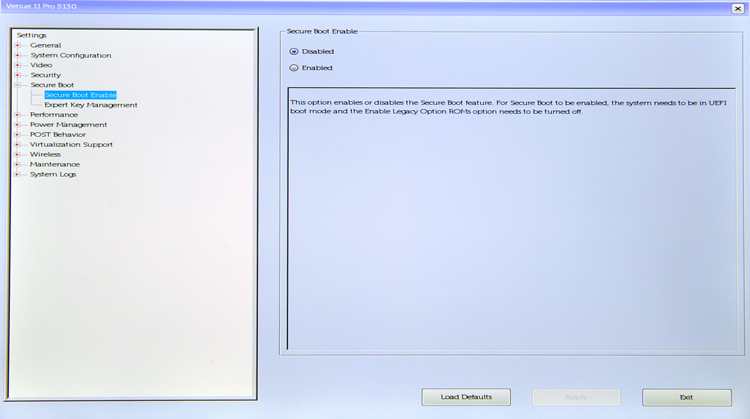

# Prepare Windows 10

1.  Double check the PC motherboard firmware "BIOS mode" is [UEFI](https://en.wikipedia.org/wiki/Unified_Extensible_Firmware_Interface). This should be the case with Windows 10.

    Each motherboard is shipped with a firmware to handle the hardware initialization process. Designed in 1975, BIOS, a.k.a. "Basic Input-Output System" has been the norm for boot firmware until 2005. UEFI, a.k.a. "Unified Extensible Firmware Interface", is BIOS' improved successor. It is shipped with modern PC and is the one used in this tutorial to install Arch Linux.

    - Open command prompt and launch "Sytem Information": `Windows + R > cmd > msinfo32`

      

    - Make sure "BIOS mode" is `UEFI`

    See [How to Check if Windows is Booted in UEFI or Legacy BIOS Mode](https://www.eightforums.com/threads/bios-mode-see-if-windows-boot-in-uefi-or-legacy-mode.29504/) for more details.

1.  Disable "fast startup":

    This is to avoid potential data loss. Indeed, Windows "fast startup" boots the sytem faster by reading the necessary information from the hibernation file. Therefore, once Windows is shutdown, if you attempt to copy some files from Linux to Windows, those files would be lost because not present in the hibernation file.

    - Go to `Control Panel > Hardware and Sound > Power Options` then select `Choose What the power buttons do` to land in `System Settings`:

      

    - Uncheck "Turn on fast start-up"

    See [Why disable Fast Boot on Windows 8 when having dual booting?](https://askubuntu.com/questions/452071/why-disable-fast-boot-on-windows-8-when-having-dual-booting) for more details.

1.  Disable "Secure Boot Control"

    With UEFI comes the "Secure Boot Control" options that ensures your PC only uses signed firmware that is trusted by the manufacturer. While it prevents malicious firmware to be installed, this could also potentially prevents you from installing Linux drivers. Note that it is still possible to [install Arch Linux with "Secure Boot Control" enabled](https://wiki.archlinux.org/index.php/Secure_Boot).

    - Enter [UEFI/BIOS configuration](./general-tips.md#enter-uefibios-configuration)

    - Disable "Secure Boot Control". Where the option is depends on the UEFI configuration screen:

      - Aptio Setup Utility - American Megatrends: under the "Security" tab, set "Secure Boot Control" to disabled: https://www.asus.com/support/FAQ/1013017/

        

      - DELL 5520: under the "Secure Boot" node, set "Secure Boot" to disabled:

        

For more information check out [How to prepare Windows for dual boot with Ubuntu or Linux Mint](https://sites.google.com/site/easylinuxtipsproject/windows).
